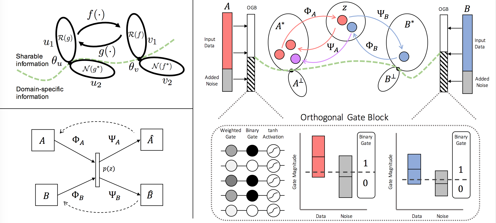

# XAE Learning Architecture for Mutual Information Disentanglement

The XAE learning architecture is designed to identify domain-sharable information learned through gated cycle consistent translation between modalities.

